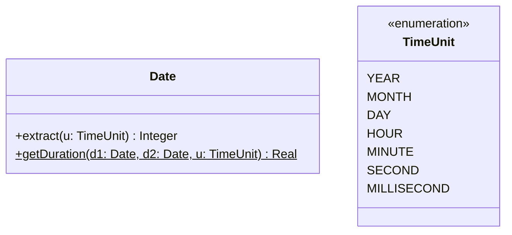
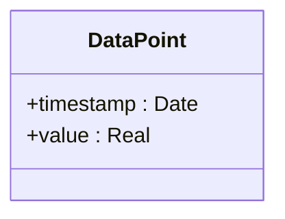
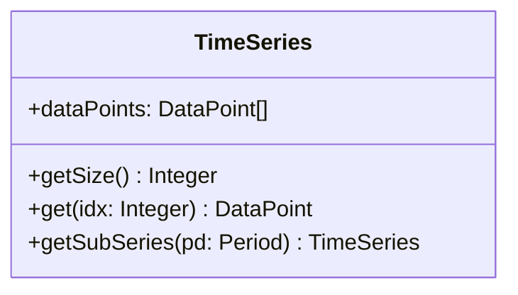
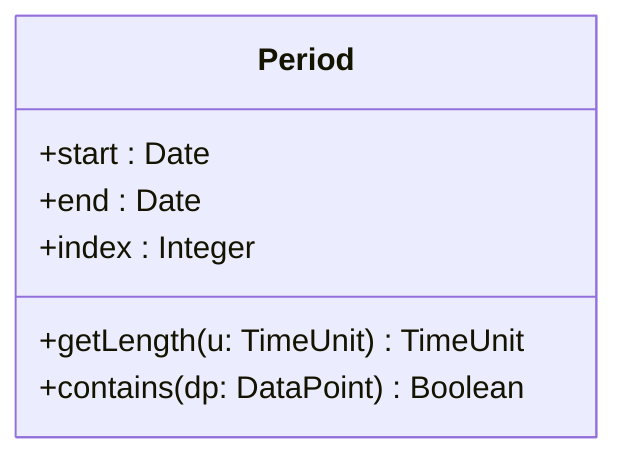
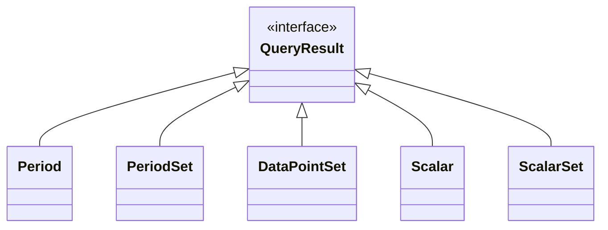
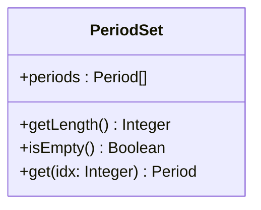
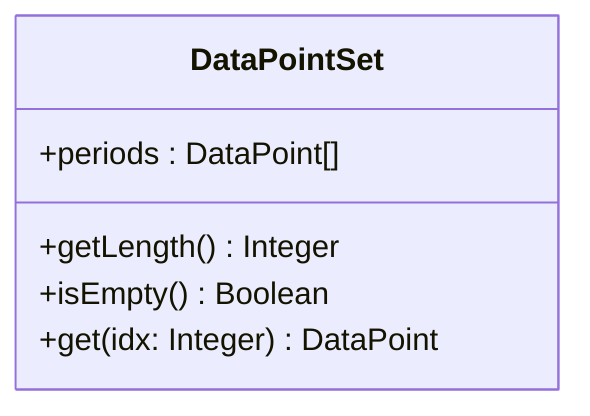
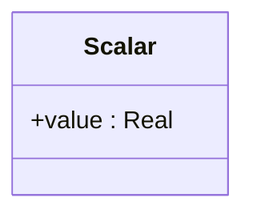
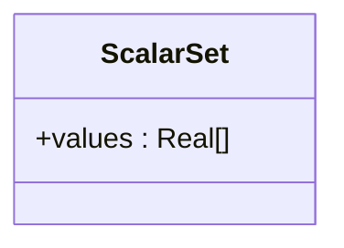

# Data Structures

This page explains how DTSQL represents different kinds of data it handles.

## Time
Some features provided by DTSQL reference specific points in time (e.g., for local aggregates) or intervals (e.g., for temporal aggregates).
The representation of time is not dictated by DTSQL's grammar and thus, generally, implementation-specific.
However, for the sake of reusing existing standards, it is recommended to utilize the [ISO 8601](https://en.wikipedia.org/wiki/ISO_8601){target=_blank} standard[^1].

Furthermore, the implementation must be capable of the following kinds of operations on date/time variables:

1. **Extracting components** from a date/time variable, i.e., year, month, day, hour, minute, second, millisecond.
??? example
    Given the ISO 8601 timestamp `2022-09-18T16:42:23.254+01:00`, the implementation should be able to extract the following components:

    * year: 2022
    * month: 9
    * day: 18
    * hour: 16
    * minute: 42
    * second: 23
    * millisecond: 254

    In words, this timestamp describes September 18th 2022 at 16:42:23 and 254 milliseconds in a timezone which is one hour ahead of UTC.

2. **Calculating the difference** between two date/time variables in (fractional) weeks, days, hours, minutes, seconds or milliseconds.
??? example

    Given the ISO 8601 timestamps `2022-09-18T08:42:23.254Z` and `2022-09-18T22:42:23.254Z`, the unt-dependent time differences are as follows:

    * week: 0,0833
    * day: 0.5833
    * hour: 14
    * minute: 840
    * second: 50 400
    * millisecond: 50 400 000

    Again, the ability to conduct this calculation in a timezone-aware manner (e.g., producing different results for timestamps with non-equal timezone offsets) is not dictated by the DTSQL specification and depends on the implementation.

The diagrams below visualize the features strictly required of a date/time representation in a DTSQL implementation.

[^1]:
    ISO 8601 offers a wide array of possibilities to express date and time-related data.
    It is completely up to the specific DTSQL implementation to what extent these capabilities are supported (e.g., unix timestamps, week with weekday notation, time zones, ordinal dates, etc.).

## Data Points

A data point represents a measurement ("sensor log").
It consists of both the time at which it was recorded and the value that was observed.
Additional operations (e.g., formatting the value up to a certain amount of precision or number of significant digits) are valid, but not required.
This is visualized below.

## Time Series

Time series are made up of several measurements, i.e., data points.
Their _size_ or _length_ is equal to the number of data points they comprise.
It is also possible to retrieve a subset of a time series from an [interval](#time-intervals).
The diagram below illustrates the structure of time series.

DTSQL stipulates two important assumptions about time series and their data points:

??? warning "Warning: Assumptions About Time Series"
    The two assumptions below greatly facilitate designing algorithms for query evaluation modules.
    DTSQL implementations are **not** expected to ensure or verify them, they rather serve as preconditions of the input data.
    
    1. Time series are in ascending order with respect to the time component of their data points.
    2. Data points in a time series are unique with respect to their time component (i.e., there are no two data points with the same time component).

    This implies that the data points of a time series are strictly monotonically increasing with respect to their time components.
    

## Time Intervals

A time interval, interval, or period is a segment of time that is defined by a lower bound and upper bound.
It may be used to capture a subset of a time series.
Since one of DTSQL's core features is the detection of periods of interest, they may be equipped with an index that denotes their position in the sequence of detected periods.
This is summarized in the image below.

## Query Results

Depending on the [Yield Component](../query-language/yield.md) of a DTSQL query, the result may take different shapes.
The paragraphs below explain the composition of the result formats supported by DTSQL.

### Period

In case a single period is returned (e.g., the longest of all detected periods), the query result is an instance of the `Period` type introduced in [Time Intervals](#time-intervals).

### PeriodSet

If the result (potentially) comprises more than one period, then an instance of `PeriodSet`, as illustrated below, is returned.

### DataPointSet

For instances when all data points are returned (either after filtering or contained by a detected period), then an object of `DataPointSet` is returned.
This data structure is very similar to [PeriodSet](#periodset), as the diagram below shows.

### Scalar

DTSQL may return the calculated values of samples.
The `Scalar` wrapper type below encapsulates these concrete aggregate values.

### ScalarSet

The `ScalarSet` structure displayed below is equivalent to [Scalar](#scalar) for the case of results consisting of multiple scalar values.

