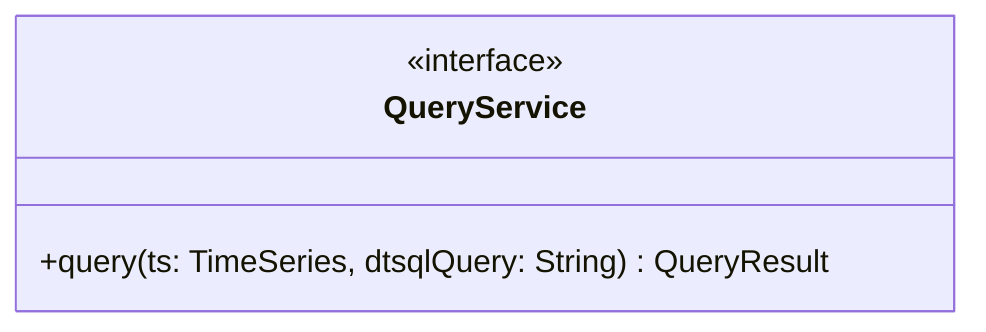
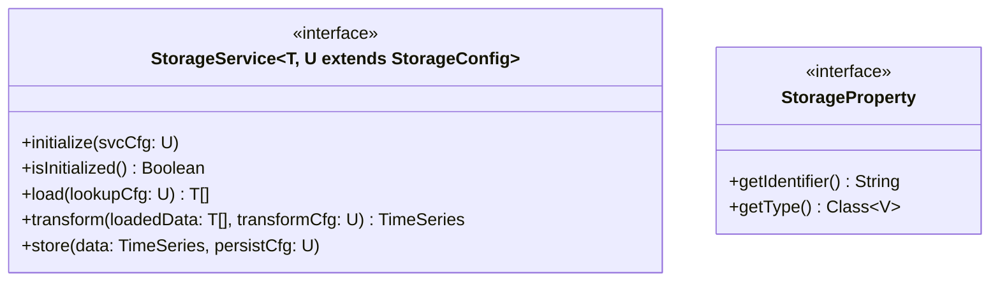
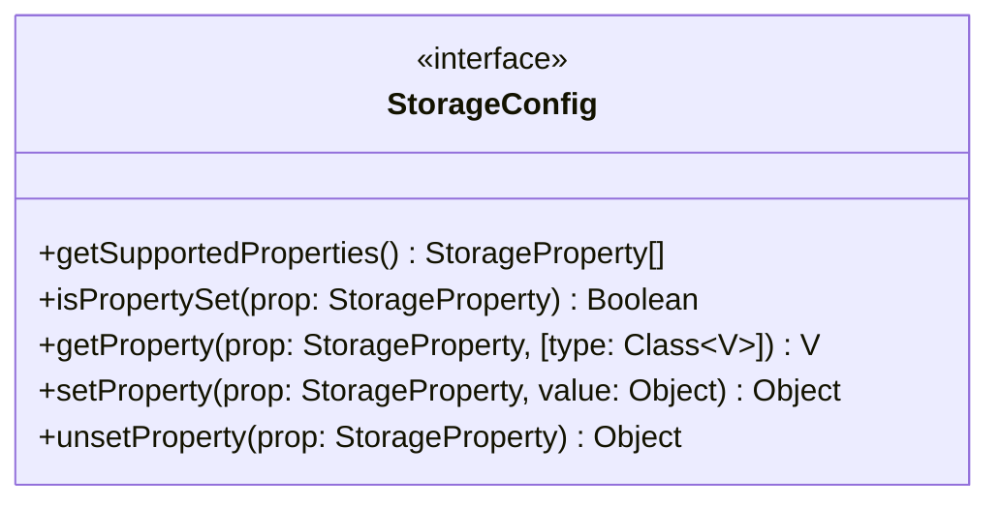

# Query API

In order to ensure the generality of DTSQL, it operates on a canonical representation of time series (as already explained in the respective section about [Time Series](../data-structures/data-structures.md#time-series)).
This allows developers to hook up any storage system containing time series data (CSV files, InfluxDB, SQL databases, web services, ...) to DTSQL.
The paragraphs below explain both how canonical time series are queried and which interfaces are involved in obtaining such queryable time series.

## Query Service

The `QueryService` interface is very simple, providing only a single method that takes a time series and a DTSQL query and returns a query result (see also the section about [Query Results](../data-structures/data-structures.md#query-results)).
Implementations should parse the query into an appropriate internal representation and then evaluate it based on the respective input time series.



## Storage Services

Before feeding a _canonical_ time series to a `QueryService` implementation, it has to be extracted from an arbitrary data source.
This is possible via the `StorageService`, `StorageConfig` and `StorageConfig` interfaces.

In general, `StorageService` provides data access, parameterized by a `StorageConfig` instance consisting of several `StorageProperty` values.
The diagrams below visualize the members of each interface.
Underneath them, dedicated content tabs provide a more in-depth view of these three interfaces, explaining their individual methods and depicting succinct examples of how they may be utilized in practice.





=== "StorageService"

    Represents an abstraction to be used to connect a custom storage mechanism to a [Query Service](#query-service) instance.

    ??? info "Info: Interface Method Descriptions"
    
        * `T`: The storage-specific (native) type of data retrieved by `load`.
        * `U`: The configuration compatible with current `StorageService` implementation, must be a subtype of `StorageConfig`.
        * `initialize`: Can be used for general setup specific to the storage (e.g., connect to database, check I/O availability, ...).
        * `isInitialized`: Determines whether the service has been initialized; is a precondition for `store`, `load` and `transform`.
        * `load`:  Reads required data from the storage with parameters specified by `lookupCfg` into the native data type `T`.
        * `transform`: Converts the data obtained from `load` into a `TimeSeries` instance according to the parameters represented by `transformCfg`.
        * `store`: Is meant to store/persist a `TimeSeries` instance into the storage system. This operation basically conducts the inverse conversion of `transform`. This method is not needed in the majority of cases. Therefore, generally, it is valid not to implement this method. 

    ??? example "Example: CsvStorageService Implementation (Prose)"
        
        For this example, we assume CSV file accesses are encapsulated by an third-party library.

        * `T`: `CsvRow`, a data structure provided by the library that represents a line in a CSV file.
        * `U`: `CsvStorageConfig`, a derived type of `StorageConfig` that is valid to feed to `CsvStorageService` (see second tab page for details).
        * `initialize`: Since file streams are opened and closed at the moment of accessing CSV files, there is nothing like an underlying database connection or web session. Therefore, this method may be empty.
        * `isInitialized`: For the reasons explained above, this method may always return `true`.
        * `load`: The `CsvStorageConfig` instance `lookupCfg` contains parameters such as file path, field delimiter, and a number of lines to skip before parsing. Using those parameters, the CSV library can be instructed to load the desiredd data as `CsvRow` instance.
        * `transform`: In order to convert a range of `CsvRow` instances to `DataPoint` objects (and subsequently a `TimeSeries`), the `transformCfg` contains information such as index of date and value columns and date/time format to correctly parse time components of data points. 
        * `store`: If one were to implement this method, `persistCfg` should contain information such as destination path, field separators to use, format to serialize time components into and possibly an option to toggle create/append file modes.

=== "StorageConfig"

    Represents a container for the configuration (properties) of a concrete `StorageService`.

    ??? info "Info: Interface Method Descriptions"

        * `getSupportedProperties`: Returns a range of `StorageProperty` instances that are valid for the current `StorageService` implementation. All methods below throw an error if a non-supported property is passed to them.
        * `isPropertySet`: Determines whether there currently is a value associated with `prop`.
        * `getProperty`: Returns the value currently associated with `prop`, if available. If the optional `type` parameter is present, the result of this method is of type `V` (the type of `prop`), otherwise `Object`.
        * `setProperty`: Associates `prop` with the value `value and returns the value it previously was associated with, if available.
        * `unsetProperty`: Removes the association of `prop` with a value and returns the value it previously was associated with, if available. 

    ??? example "Example: CsvStorageConfig Implementation (Prose)"
        The implementation of all interface methods (except `getSupportedProperties`) is very similar for (almost) all storage mechanisms.
         Therefore, it is recommended to provide an abstract base class that conforms to the informal descriptions above.
         That way, concrete `StorageConfig` implementation need only be concerned with supplying the supported storage properties.
         The kinds of properties conceivable for a `CsvStorageConfig` are enumerated on the tab concerned with the `StorageProperty` interface.

=== "StorageProperty"
     
    Represents a configuration property to be used within `StorageConfig` implementations.
    Instances of this interface are  **not** associated with values.
    The actual values of storage configuration properties are managed solely by `StorageConfig` instances.
    Furthermore, object equality is determined by their identifier.
    A `StorageConfig` must not support two different properties with the same identifier.

    ??? example "Example: CsvStorageProperty Implementation (Prose)"
        Depending on the concrete programming language, the way of implementing multiple storage properties can differ widely in both manner and succinctity (lambdas, anonymous classes, constants, `static final` instances, parameterized enum members).
         The table below summarizes some possible configuration properties of a CSV storage service.

        | name     | identifier     | type     | used by     |
        |-----|-----|-----|-----|
        | `FILE_PATH`    | filePath     | String     | `load`, `store`     |
        | `FIELD_SEPARATOR`    |  fieldSeparator     | Character     | `load`, `store`     |
        | `TIME_COLUMN`     | timeColumn     | Integer     | `transform`     |
        | `TIME_FORMAT`    | timeFormat     | String     | `transform`, `store`     |
        | `VALUE_COLUMN`    | valueColumn     | Integer     | `transform`     |
        | `SKIP_HEADERS`    | skipHeaders     | Integer     | `load`     |
        | `APPEND`     | append     | Boolean     | `store`     |

    This second example demonstrates a succinct `Java` representation of the table above, in the form of an enum implementing the `StorageProperty` interface.

    ??? example "Example: CsvStorageProperty Implementation (Java)"

        ```java
        public enum CsvStorageProperty implements StorageProperty {
          /**
           * Used by load, store.
           */
          FILE_PATH("filePath", String.class),
        
          /**
           * Used by load, store.
           */
          FIELD_SEPARATOR("fieldSeparator", Character.class),
        
          /**
           * Used by transform.
           */
          TIME_COLUMN("timeColumn", Integer.class),
        
          /**
           * Used by transform, store.
           */
          TIME_FORMAT("timeFormat", String.class),
        
          /**
           * Used by transform.
           */
          VALUE_COLUMN("valueColumn", Integer.class),
        
          /**
           * Used by load.
           */
          SKIP_HEADERS("skipHeaders", Integer.class),
        
          /*
           * Used by store.
           */
          APPEND("append", Boolean.class),
        
          private final String identifier;
        
          private final Class<?> type;
        
          CsvStorageProperty(String identifier, Class<?> type) {
            this.identifier = identifier;
            this.type = type;
          }
        
          @Override
          public String identifier() {
            return identifier;
          }
        
          @Override
          public Class<?> type() {
            return type;
          }
        }
        ```
