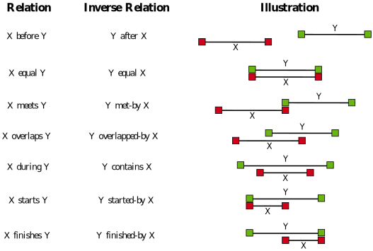
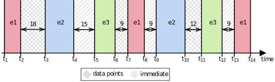

# Selection

The optional selection component utilizes _selection operators_ to define temporal relations between the intervals represented by the [events component](events.md).
This makes it possible to create more complex, _composite events_ by connecting the previously defined (_atomic_) events temporally using their identifiers.

## Temporal Relations

The figure below illustrates possible temporal relations between intervals:

<!--suppress HtmlUnknownAttribute -->
<figure markdown>
  
  <figcaption markdown>Allen's Interval Relations. Adapted From (Allen, 1983)[^1]</figcaption>
</figure>

[^1]: James F. Allen. 1983. Maintaining knowledge about temporal intervals. Communications of the ACM 26, 11 (Nov. 1983), 832–843. [https://doi.org/10.1145/182.358434](https://doi.org/10.1145/182.358434){target=_blank}

## Selection Operators

In fact, DTSQL supports four of the thirteen relations introduced by Allen[^1]: `meets`, `met-by`, `before` and `after`.
This is realized by means of two selection operators `precedes` and `follows` which have an optional time-gap constraint.
If this constraint is present, `before`/`after` semantics are used, otherwise `meets`/`met-by`.

An instance of such an operator forms a binary event sequence.
DTSQL supports n-ary sequences as well by allowing selection operators to be declared recursively.
This is shown in the syntax of the selection component and its subcomponents below:

```dtsql
['SELECT PERIODS:'
  <operator>
  ['FOR' {'('|'['} [<minLength>]',' [<maxLength>] {')'|']'} <unit>]]
```
Again, the selection component is optional, but if it is present, then a selection operator is compulsory.
In this definition, in order to allow for proper recursion, the placeholder `<operator>` is defined as follows:

```dtsql
'('{<eventIdentifier>|<operator>} {'follows'|'precedes'} {<eventIdentifier>|<operator>}')'
```

The recursive base case is when both the left and right operator is an event identifier.

!!! warning "Warning: Event Identifier vs. Sample Identifier"
    It is prohibited to reference a sample within the selection component, only event identifiers are valid in this context.
    A DTSQL parser must throw an error if a sample is referenced by a selection operator.

The previously mentioned optional time-gap constraint (starting with `WITHIN`) changes the semantics employed during (composite) period detection.
If it is present, an event sequence defined by a temporal relation is detected based on the length of the time-gap between the bounds of the participating periods (`before`/`after`).
If it is not present, the temporal relation is deemed satisfied only if there are no data points in between the (`meets`/`met-by`).

???+ warning "Warning: Absent Time-Gap Constraint vs. `WITHIN [,]`"
    A consequence of the paragraph above is that, unlike for duration constraints with [filters](filters.md), a time-gap of `[,]` (arbitrary unit) is **not** equivalent to no such constraint being presen at all.
    
    If no time-gap constraint is present, it means that there must not be a single data point in between the end and start of periods forming a (binary) event sequence (`meets`/`met-by` semantics).
    
    On the other hand, a time-gap constraint of `WITHIN [,] <unit>` is equivalent to `WITHIN [0,] <unit>` which defines an acceptable range of 0 to infinite `<unit>` between periods composing a (binary) event sequence.
    In other words, the second variant denotes that the time-gap may be arbitrarily large, which, in fact, represents the conceptual opposite of leaving out the constraint.

## Examples

??? example "Example: Selection Component (1)"
    Assume a query with events `e1`, `e2`, `e3` with correspondingly detected periods as depicted in the figure below.
    The shading of the sections between intervals indicates whether there are data points recorded in those gaps or not ("immediate").

    <figure markdown>
        
    </figure>

    Now assume the following selection component:

    ```dtsql
    SELECT PERIODS:
      (e1 follows (e2 precedes e3 WITHIN [0,15] minutes))
    ```
    
    The (recursive) evaluation of the selection operators yields that the nested `(e2 precedes e3 WITHIN [0,15] minutes)` represents the composite intervals `t3-t6` as well as `t9-t12`.
    Based on that, the overall selection evaluation yields the composite interval `t9-t14` because this is the only instance where event `e1` immediately follows a period from the nested operator.  

??? example "Example: Selection Component (2)"
    Assume events `e1`, `e2` and `e4`.
    Furthermore, assume that you want to capture ternary event sequences where `e2` appears before a `e1 -> e4` pair with not more than 30 minutes apart.
    The corresponding selection component is depicted below.

    ```dtsql
    USING EVENTS:
      (...) AS e1,
      (...) AS e2,
      (...) AS e4
    SELECT PERIODS:
      (e2 precedes (e4 follows e1) WITHIN [0,30] minutes)
    ```

??? example "Example: Selection Component (3)"
    Assume a query with events `e1`, `e2`, `e3`, `e4`.
    Furthermore, suppose three scenarios `(a)`, `(b)`, `(c)` where the evaluation of the events component yields event sequences as depicted in the diagram below.
    An arrow without text depicts an interval transition without data points in between, an arrow with time information merely states the time difference between the bounds of the intervals involved (there may be data points in between or not).

    ```mermaid
    stateDiagram-v2
        state (a) {
            direction LR
            e2_a: e2
            e1_a: e1
            e4_a: e4
            e2_a --> e1_a
            e1_a --> e4_a
        }
        state (b) {
            direction LR
            e4_b: e4
            e2_b: e2
            e1_b: e1
            e2_b --> e1_b: 40 min
            e2_b --> ...
            ... --> e1_b
            e1_b --> e4_b
        }
        state (c) {
            direction LR
            e1_c: e1
            e3_c: e3
            e4_c: e4
            e3_c --> e1_c
            e1_c --> e4_c
        }
    ```

    Now, consider four different selection components:

    ```dtsql
    S1: SELECT PERIODS: (e4 follows (e1 follows e2)) 
    S2: SELECT PERIODS: (e4 follows (e1 follows e2 WITHIN [0,45] minutes))
    S3: SELECT PERIODS: (e4 follows e1)
    S4: SELECT PERIODS: (e2 precedes (e4 follows e1) WITHIN [0,30] minutes)
    ```

    `S1` represents scenario `(a)`, but neither `(b)` nor `(c)`.
    `S2` describes scenario `(b)`, and maybe `(a)`, depending on the time-gap between `e2` and `e1`.
    `S3` characterizes all scenarios `(a)`, `(b)`, `(c)`.
    Finally, `S4` is not guaranteed to match any scenario: Only `(a)` could potentially fit, if the end of `e2` and the start of `e1` are not more than 30 minutes apart.
